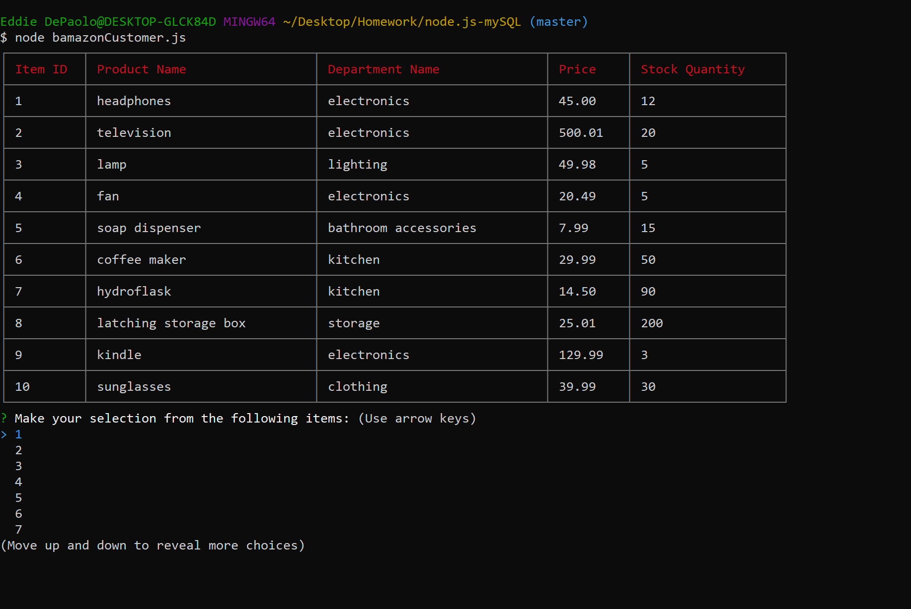
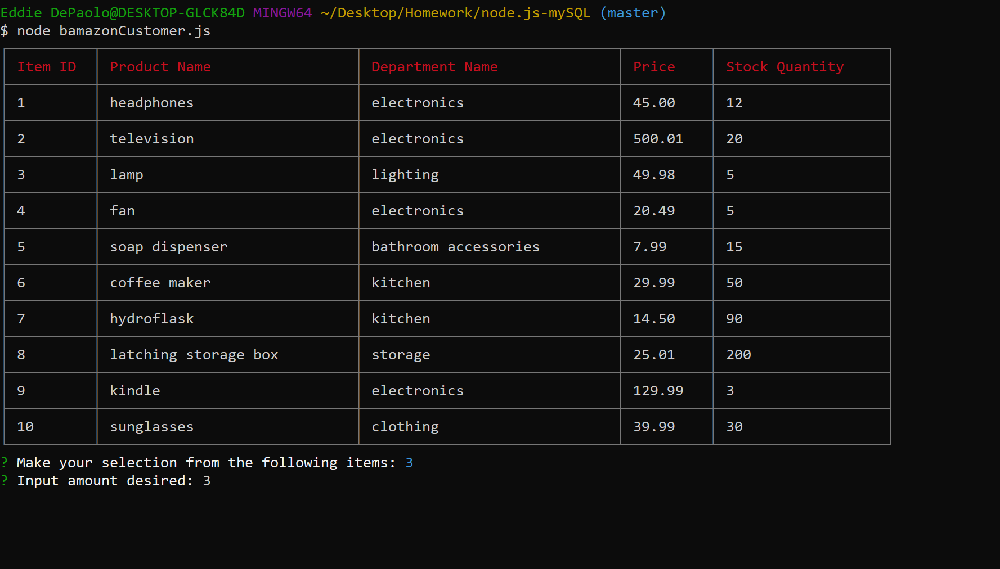
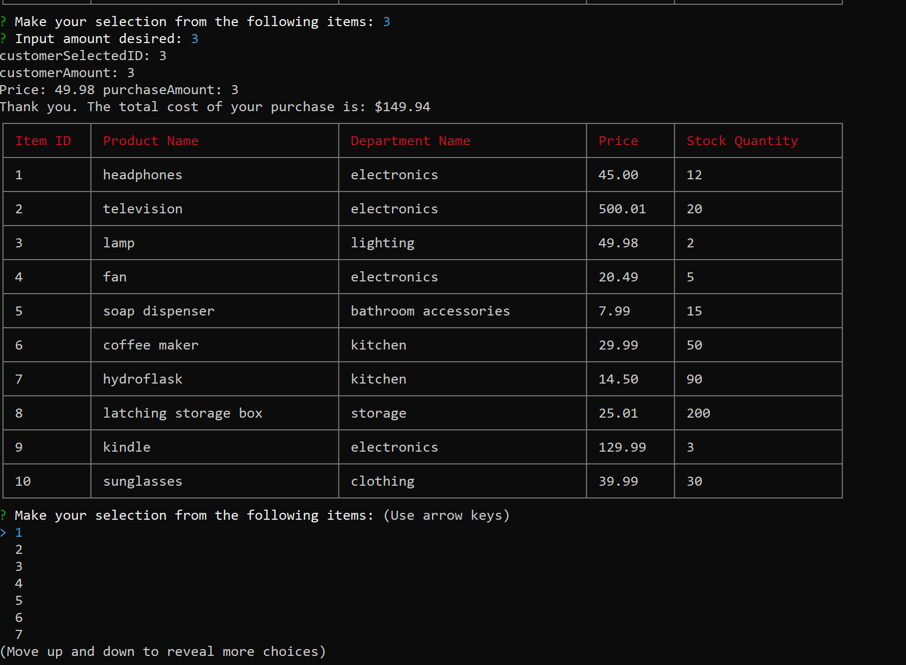

# node.js-mySQL
Amazon-like storefront with the MySQL database. This app will take in orders from customers and deplete stock from the store's inventory. 

## Bamazon "Storefront"

## Customer Input

## Final transaction amounts including Total Amount Purchased, Total Cost, and Updated Inventory Table

